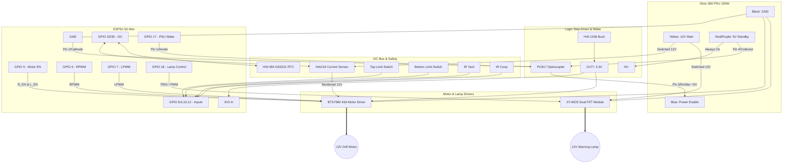

# ChickenFlow Hardware & Wiring Architecture (High-Power Rev)

**Target MCU:** ESP32-S2 Mini (`lolin_s2_mini`)
**Main Power:** Xbox 360 PSU (150W / 12.1A)
**Motor:** 12V Hand Drill Motor + Mechanical Brake
**Driver:** BTS7960 (43A H-Bridge)
**Auxiliary:** 12V Warning Lamp (Driven by XY-MOS)

## Architecture Overview
This system uses a split-power architecture to optimize efficiency and safety. The ESP32 and sensors are powered 24/7 by the Xbox PSU's 5V Standby rail (stepped down to 3.3V). The main 12V rail is kept OFF (Standby/Orange LED) until the door needs to move. The ESP32 wakes the 12V rail via a PC817 optocoupler.

A BTS7960 drives the high-torque drill motor, protected by an INA219 current sensor on the high side to detect physical stalls, triggering an immediate shutdown and mechanical braking. A 12V lamp driven by an XY-MOS module provides visual status warnings.

## Wiring Diagram

## Explicit Pinout & Connections

### 1. Power Management & Wake Circuit
| Component | Pin / Wire | Connects To | Notes |
| :--- | :--- | :--- | :--- |
| **Xbox PSU** | Red/Purple (5V SB) | HW-1338 IN+ & PC817 Pin 4 | Always-ON 5V logic source |
| **Xbox PSU** | Yellow (12V) | INA219 Vin+ & XY-MOS VIN+ | Switched High-Current supply |
| **Xbox PSU** | Black (GND) | Common GND | Tie to ESP32, Buck, BTS, & XY-MOS |
| **HW-1338** | OUT+ | ESP32 `3V3` Pin | MUST be tuned to exactly 3.3V |
| **PC817 (Opto)** | Pin 1 (Anode) | ESP32 GPIO 17 | Requires series resistor (e.g., 220Ω) |
| **PC817 (Opto)** | Pin 3 (Emitter) | Xbox PSU Blue (Power EN) | Passes +5V to Blue wire to wake PSU |

### 2. Motor Driver (BTS7960)
| BTS7960 Pin | Connects To | Role |
| :--- | :--- | :--- |
| **VCC** | 3.3V Rail | Logic power (from HW-1338 OUT+) |
| **R_EN** | ESP32 GPIO 5 | Enable Forward (Physically bridge to L_EN) |
| **L_EN** | ESP32 GPIO 5 | Enable Reverse (Physically bridge to R_EN) |
| **RPWM** | ESP32 GPIO 6 | Forward PWM (Open Door) |
| **LPWM** | ESP32 GPIO 7 | Reverse PWM (Close Door) |
| **B+** | INA219 Vin- | 12V in (Post-current sensor) |
| **B-** | Common GND | High-current ground return |
| **M+ / M-** | Drill Motor | Motor Output |

### 3. I2C Bus & Safety Sensors
| Component | ESP32-S2 Pin | Role |
| :--- | :--- | :--- |
| **I2C SDA** | GPIO 33 | Shared by INA219 & HW-084 (DS3231) |
| **I2C SCL** | GPIO 35 | Shared by INA219 & HW-084 (DS3231) |
| **Limit Top** | GPIO 12 | INTERNAL PULLUP (Active Low) |
| **Limit Btm** | GPIO 8 | INTERNAL PULLUP (Active Low) |
| **IR Yard** | GPIO 9 | Object detection A (Active Low) |
| **IR Coop** | GPIO 10 | Object detection B (Active Low) |

### 4. Indicators & Lighting (12V Lamp)
| Component | ESP32-S2 Pin | Role |
| :--- | :--- | :--- |
| **XY-MOS TRIG** | GPIO 18 | 3.3V Logic Gate Trigger |
| **XY-MOS VIN+ / VIN-**| Xbox PSU 12V / GND | Source Power for Lamp |
| **XY-MOS OUT+ / OUT-**| 12V Lamp Positive/Negative | Power delivery to physical lamp |
| **Passive Buzzer**| GPIO 14 | Audio Alerts |

---

## ⚠️ Critical Implementation Instructions

1. **Common Ground is Mandatory:** The Black ground wires from the Xbox PSU must connect directly to the BTS7960, the XY-MOS, the HW-1338 Buck, and the ESP32. A floating ground will destroy the I2C bus and logic pins.
2. **Xbox PSU Active-High Wake:** The Xbox 360 PSU is *not* like an ATX power supply. Do NOT pull the Blue wire to ground. You must apply +5V to the Blue wire to turn the PSU green. This is achieved safely via the PC817 optocoupler bridging the Red (5V SB) to the Blue (EN).
3. **XY-MOS Low-Side Switching Warning:** The XY-MOS switches the *Ground* line, not the positive line. **The `OUT+` terminal is always live with 12V.** Ensure the 12V lamp housing is electrically isolated from any grounded metal on the coop, otherwise the lamp will bypass the MOSFET and stay on permanently.
4. **Motor Soft-Start Requirement:** A 12V drill motor will pull immense inrush current on startup. The firmware *must* ramp the PWM signal over ~1.5 seconds. Instantly applying PWM 255 will trigger the Xbox PSU's Over-Current Protection (OCP), shutting down the 12V rail and dropping the system into a hardware fault state.
5. **Logic Level Compatibility:** The BTS7960 and XY-MOS trigger pins are fully 3.3V compatible. No logic level shifters are required between the ESP32-S2 and these modules.
6. **Lamp Visibility Gated by PSU:** The 12V warning lamp draws from the switched 12V rail, so it only illuminates when the Xbox PSU is awake. Firmware drives the lamp HIGH during every active motor phase (`WAKING_PSU`, `MOVING`, `ACTIVE_BRAKE`, `REOPEN`). The periodic **audio reminder** on the passive buzzer is the canonical 24/7 service-mode indicator — the lamp cannot serve that role because waking the PSU just to light a bulb wastes the whole standby-power architecture.
